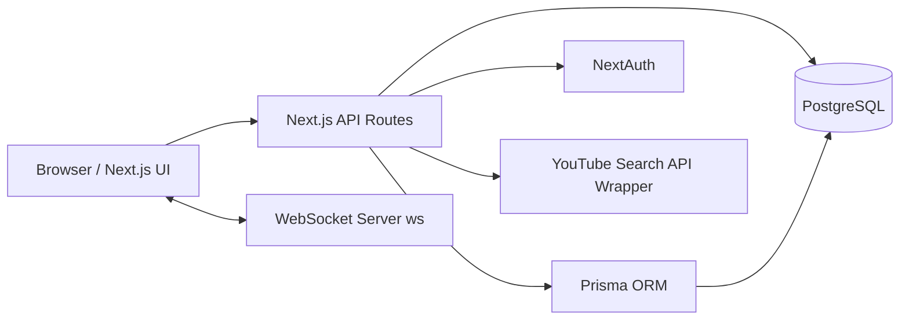

# Conflux Rooms

Conflux Rooms is a real-time, collaborative room platform where users create shared rooms, add music or YouTube videos, vote on what should play next, and chat live.

This project is built as a production-style full-stack system with:
- a Next.js web app for UI, auth, APIs, and queue orchestration
- a dedicated WebSocket service for low-latency realtime events
- PostgreSQL + Prisma for durable data and relational integrity

## Why This Project Stands Out

- Solves a real product problem: group playback with democratic queue control
- Uses modern architecture beyond a simple CRUD app (REST + WebSocket hybrid)
- Includes practical engineering concerns recruiters look for:
  - authentication with OAuth + credentials
  - authorization (host/owner permissions)
  - realtime presence/chat/reactions
  - rate limiting and abuse prevention
  - background cleanup jobs for stale data

## Core Features

- Authentication
  - Google OAuth and Email/Password sign-in via NextAuth
  - Secure password hashing with bcrypt

- Room Management
  - Create rooms with shareable 6-character codes
  - Join existing rooms by code
  - Persist room membership and host identity

- Music Queue
  - Add songs by pasting YouTube URL
  - Search YouTube and add directly from results
  - Queue sorted by vote count
  - Auto-select fallback when current song changes

- Voting and Moderation
  - Upvote/downvote per user-track pair (unique vote constraint)
  - Remove song permissions:
    - room host can remove any song
    - user can remove their own song

- Realtime Collaboration
  - Live queue refresh signaling
  - Shared current-track state across clients
  - Room presence (member list + online count)
  - Live chat with timestamps
  - Emoji reactions broadcast to all listeners

- Reliability Features
  - Song submission cooldown (1 song per user per room per minute)
  - Daily cleanup cron that deletes inactive rooms (>24h inactivity)
  - Cascading deletes to avoid orphaned records

## Architecture

### High-Level Design



### Service Split

- `app/` (Next.js 16 + React 19)
  - App Router pages and UI
  - Server API routes (`/api/*`)
  - Auth and session handling
  - Prisma data access

- `ws/` (Node.js + ws)
  - Socket room coordination
  - Presence, chat, reactions, and stream-sync events

### Realtime Event Model

Client emits:
- `join-room`
- `stream-updated`
- `set-current-stream`
- `chat-message`
- `reaction`

Server broadcasts:
- `joined-room`
- `room-members`
- `user-joined`
- `stream-updated`
- `current-stream`
- `chat-message`
- `reaction`

## Data Model (Prisma)

Primary entities:
- `User`: auth identity and provider metadata
- `Room`: collaborative session container
- `RoomUser`: many-to-many membership table
- `Stream`: queued track in a room
- `Upvote`: per-user vote on stream (unique composite key)
- `CurrentStream`: active track reference

Key constraints and rules:
- unique room code
- unique `(userId, roomId)` membership
- unique `(userId, streamId)` vote
- cascade deletes for room->streams->votes integrity

## Tech Stack

Frontend and App Layer:
- Next.js 16 (App Router), React 19, TypeScript
- Tailwind CSS, Framer Motion, Lucide Icons, Sonner

Backend and Data:
- Next.js Route Handlers (REST APIs)
- Node.js WebSocket server (`ws`)
- PostgreSQL + Prisma ORM
- Zod validation

Auth and Security:
- NextAuth (Google + Credentials)
- bcrypt password hashing

## API Overview

Representative endpoints:
- `POST /api/room/create` - create room and assign host
- `POST /api/room/join` - join room by room code
- `GET /api/room/[roomId]/streams` - fetch room queue ordered by votes
- `POST /api/streams` - add stream (validation + rate limit)
- `GET /api/streams/search?q=` - YouTube search for add flow
- `POST /api/streams/upvote` - upvote stream
- `POST /api/streams/downvote` - remove user vote
- `DELETE /api/streams/remove?streamId=` - host/owner-only delete
- `GET /api/room/cleanup` - cron-triggered stale-room cleanup

## Local Setup

### 1. Clone and install dependencies

```bash
git clone <your-repo-url>
cd Muziffy

cd app
pnpm install

cd ../ws
pnpm install
```

### 2. Configure environment variables

Create `app/.env`:

```env
DATABASE_URL=postgresql://...
NEXTAUTH_SECRET=your_random_secret
NEXTAUTH_URL=http://localhost:3000

GOOGLE_CLIENT_ID=...
GOOGLE_CLIENT_SECRET=...

NEXT_PUBLIC_WS_URL=ws://localhost:8080
```

### 3. Prepare database

```bash
cd app
pnpm prisma generate
pnpm prisma migrate dev
```

### 4. Run both services

Terminal 1:
```bash
cd app
pnpm dev
```

Terminal 2:
```bash
cd ws
pnpm dev
```

App runs on `http://localhost:3000`.

## Production Notes

- Deploy `app/` as the web service (Vercel-ready)
- Deploy `ws/` as a separate long-running Node service
- Set `NEXT_PUBLIC_WS_URL` to your production WebSocket endpoint
- `vercel.json` includes a daily cron trigger for room cleanup

## Resume-Friendly Engineering Highlights

- Designed a multi-service architecture integrating stateless HTTP APIs with persistent realtime sockets
- Implemented role-aware authorization for moderation actions in collaborative rooms
- Built resilient queue workflows with vote ordering, optimistic UI updates, and sync notifications
- Added safeguards (rate limiting + data lifecycle cleanup) to improve reliability at scale
- Modeled relational domain data with strong constraints to enforce business rules at the database layer

## Project Structure

```text
Muziffy/
  app/      # Next.js app, APIs, auth, Prisma schema
  ws/       # WebSocket realtime server
```

## License

This project is for portfolio/demo use. Add a formal license (MIT, Apache-2.0, etc.) before public distribution.
